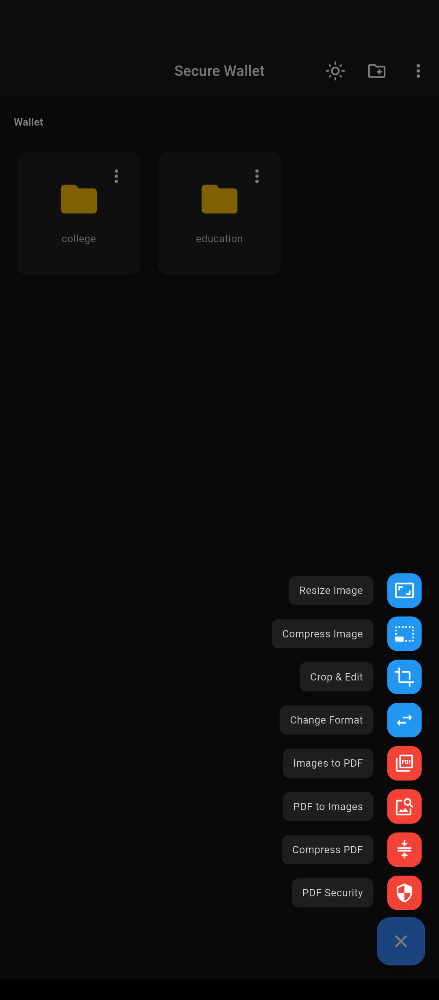
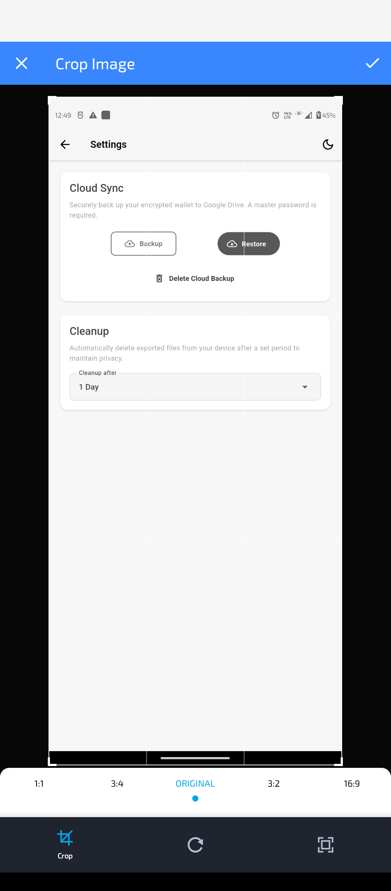
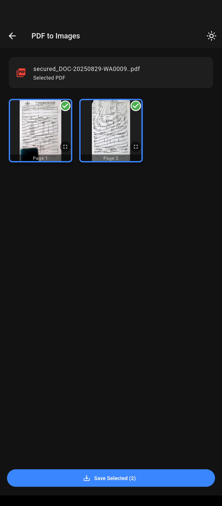
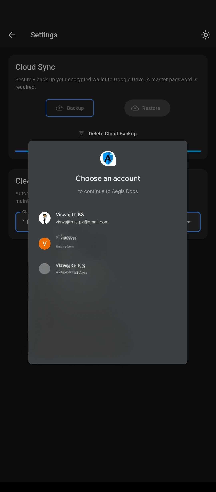

# Aegis Docs: Secure, Offline-First Document Wallet 🛡️

Aegis Docs is a high-performance, privacy-focused mobile application built with Flutter. It provides a secure, **on-device** digital safe for your sensitive documents, featuring a powerful suite of offline tools and an optional, end-to-end encrypted cloud sync.

---

## 🧠 The Philosophy: Your Data, Your Device

In an era where data privacy is paramount, Aegis Docs is built on one core principle: **you should have complete control over your sensitive information**.

* ✅ **100% Offline Processing:** All features—from image compression to PDF encryption—run directly on your device. Nothing is ever sent to a server.
* 🔒 **Privacy by Design:** The app is fully functional without an internet connection. The cloud sync feature is strictly optional and end-to-end encrypted, meaning only you can access your data.
* 🧹 **Automatic Cleanup:** To protect your privacy and save space, any temporary files exported to public folders are automatically cleaned up based on your preference (e.g., after 10 minutes, 1 day, or 1 week).

---

## ✨ Key Features

A comprehensive toolkit for managing your digital documents securely and efficiently.

### Image Tools 🖼️
- **Resize:** Reduce image dimensions while maintaining aspect ratio.
- **Compress:** Significantly lower file size with minimal quality loss.
- **Edit:** Crop, apply a grayscale filter.
- **Convert:** Change formats (JPG, PNG, GIF and more).

### PDF Tools 📄
- **Images to PDF:** Combine multiple images into a single, organized PDF document.
- **PDF to Images:** Extract specific pages from a PDF file as high-quality images.
- **Lock PDF:** Secure your PDFs with password-based encryption.
- **Native PDF Compression:** A high-performance compression engine that intelligently reduces file size, with or without preserving text clarity.

---

## 🚀 The Technical Core: Native PDF Compression

A standout feature of this project is its high-performance PDF compression, which was achieved by going beyond standard Dart libraries.

There were no existing Flutter package could meet the performance and quality requirements for PDF compression, so a native integration approach was required:
1.  **Compiled MuPDF:** Compiled the powerful, open-source C/C++ library **MuPDF** from source for Android and iOS.
2.  **Platform Integration:** Built a bridge between the Dart front-end and the native code using Flutter's **Platform Channels**.
3.  **Result:** This provides lightning-fast, efficient, and reliable PDF compression that runs entirely on-device, a capability not readily available in the Flutter ecosystem.

---

## 🛠️ Tech Stack & Architecture

Built with a focus on performance, scalability, and maintainability.

| Component                 | Technology / Principle                                                              |
| ------------------------- | ----------------------------------------------------------------------------------- |
| **Architecture** | **MVVM (Model-View-ViewModel)** in a feature-first project structure.               |
| **State Management** | **Riverpod** (with code generation) for robust and compile-time safe state.         |
| **Navigation** | **GoRouter** for a declarative, URL-based routing strategy.                         |
| **Asynchronous UI** | **Isolates** to offload heavy tasks (encryption, image processing) for a jank-free UI. |
| **Native Integration** | **Platform Channels** to communicate with the natively compiled **MuPDF** library.    |
| **Security** | **AES-256** encryption for all stored files.                                        |
| **Optional Cloud Sync** | **Google Drive API** (App Data Folder) & **Firebase Authentication**.                 |

---

## 📸 snapshots

| Home Screen (Wallet) | Image Processing Tools | PDF Security Options | Backup Tools |
| --------------------- | ---------------------- | -------------------- | ------------- |
|  |  |  |  |

check out more on the snapshots folder

---

## 🚀 Getting Started

To get a local copy up and running, follow these simple steps.

1.  **Firebase & Google Cloud Setup:** Configure Firebase for Google Sign-In (`flutterfire configure`) and enable the Google Drive API in your Google Cloud project.
2.  **Install Dependencies:** `flutter pub get`
3.  **Run Code Generation:** `flutter pub run build_runner build --delete-conflicting-outputs`
4.  **Run the App:** `flutter run`
5.  **Get OAuth client id** get the client id from google cloud console and add it to lib/app/config/app_secrets.dart

---

## 📄 License

This project is licensed under the MIT License - see the `LICENSE.md` file for details.

## 🗺️ Future Roadmap

Here are some of the features and improvements planned for Aegis Docs:

* **🤖 AI-Powered Workflows:** Integrating a natural language processing model to allow users to create multi-step commands, such as *"resize my passport photo, compress it, and save as a PDF."*
* **📅 Document Expiration Alerts:** Adding a feature to set renewal dates for documents (like passports, licenses) and receive timely notifications before they expire.
* **🏷️ Enhanced Organization:** Implementing tags and custom folders for better document categorization and search.

Contributions are welcome! If you're interested in tackling one of these, please feel free to open an issue to discuss it.
